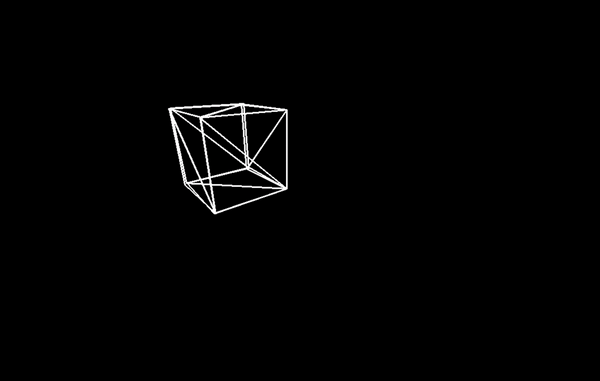

# Python 3D Graphics Engine
This is a WIP Python 3D graphics engine built from scratch, designed to render 3D graphics. It provides a framework for creating interactive graphical applications using Python. Currently all of the features below are NOT implemented, but are planned to be added.

## Features
* **3D Rendering:** The engine supports rendering of 3D objects such as meshes, textures, and lights. It utilizes algorithms such as rasterization or ray tracing to generate realistic 3D scenes.

* **Shading and Lighting:** The engine supports various shading models such as flat shading, Gouraud shading, or Phong shading to simulate the interaction of light with 3D objects. It also includes different light sources like point lights or directional lights.

* **Camera and Projection:** The engine allows you to define a virtual camera and control its position and orientation within the 3D scene. It supports perspective and orthographic projections to control the visual perspective of the rendered scene.

* **User Interaction:** The engine handles user input events like mouse clicks or keyboard presses, allowing you to implement interactivity within your 3D applications.

## Requirements
The code uses only built-in python modules with the exception of Pygame. Pygame is used to create the windows and draw lines to the windows. To install the correct version of Pygame, please see the "requirements.txt" file, or use "pip install -r requirements.txt" in a terminal.

## Examples

Please Note, due to video compression, the animation appears at a lower frame rate.
